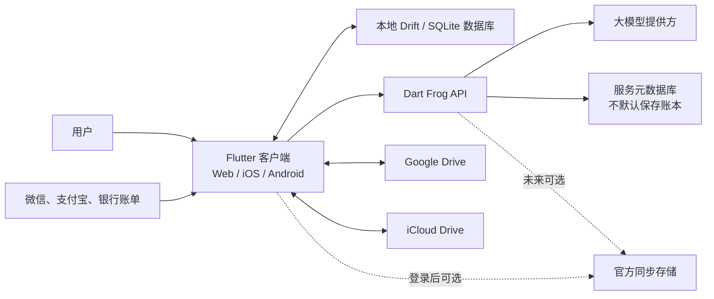
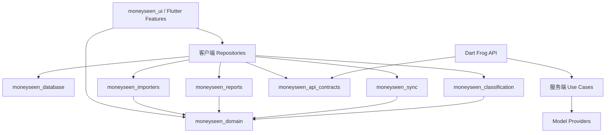
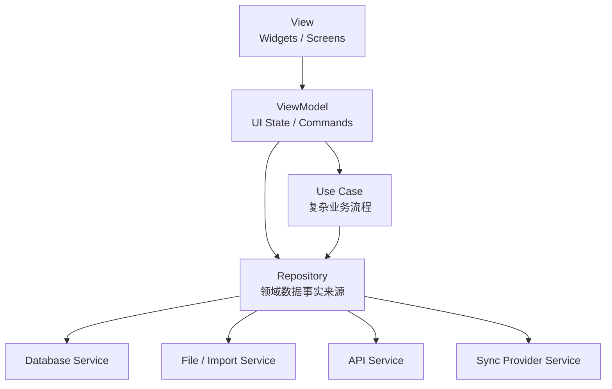
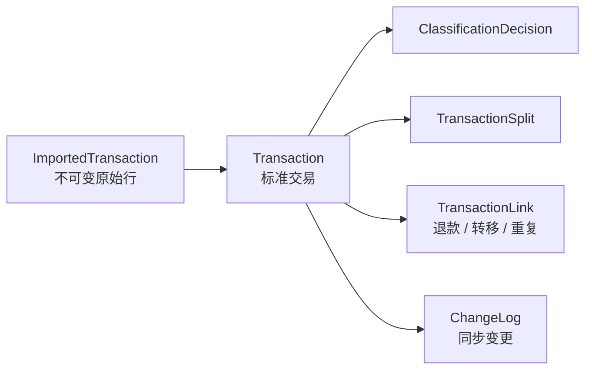
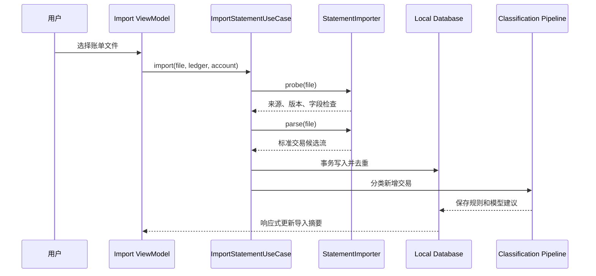

# MoneySeen 系统架构

本文档定义 MoneySeen 从开源 MVP 到 App Store、Google Play 和正式云服务的技术架构。产品需求以根目录 [README](../README.md) 为准，本文聚焦系统边界、代码组织、数据流、后端职责、同步策略和演进路径。

## 1. 架构结论

MoneySeen **需要后端，但不需要把个人账本搬到后端才能运行**。

采用以下总体方案：

- 使用 Flutter 构建 Web、iOS 和 Android 客户端。
- 采用本地优先架构，本地数据库是账本数据的唯一默认事实来源。
- 账单文件在设备端解析、标准化、去重和生成报表。
- Dart Frog 后端负责大模型代理、匿名会话、配额、限流、防滥用、远程配置和模型输出校验。
- Google Drive 和 iCloud Drive 同步由客户端同步适配器完成，默认不经过 MoneySeen 后端。
- 后续注册登录后，后端再增加用户、订阅和官方同步服务；不能因此推翻本地数据层。
- 开源自托管版本可以关闭官方后端，使用纯规则分类，或配置自己的 Dart Frog 服务和模型提供方。

### 为什么不能完全无后端

如果客户端直接调用大模型，会产生几个不可接受的问题：

- 模型 API 密钥会出现在 Web 包或移动 App 中，无法保密。
- 开源客户端可以被修改并无限消耗官方模型额度。
- 无法统一执行限流、成本预算、模型切换、提示词版本和结果校验。
- 无法在不发布新版本的情况下暂停故障模型或调整批量大小。
- 未来登录、订阅、购买恢复和官方跨设备同步仍然需要服务端。

### 为什么后端不应成为第一版账本数据库

- 第一版无需注册，强制上传全部交易会增加延迟和产品阻力。
- 本地查询更适合大量筛选、图表下钻和离线浏览。
- 用户可以直接使用开源版本，不依赖官方服务存活。
- 账单解析和确定性分类无需云端计算。
- 后续增加登录和同步时，可以同步变化而不是重写整个应用。

## 2. 系统上下文



## 3. 信任边界

系统明确划分四个边界：

1. **设备边界**：原始账单、本地数据库、规则和完整报表默认只存在设备中。
2. **AI 边界**：只有分类所需的交易摘要会发送到 Dart Frog，再由后端转发到模型提供方。
3. **第三方云盘边界**：用户主动开启后，版本化备份写入其 Google Drive 或 iCloud Drive。
4. **官方云边界**：后续用户注册并开启官方同步后，才保存用户身份和同步数据。

日志、崩溃报告和分析事件不得跨越这些边界携带完整交易内容。

## 4. Monorepo 结构

建议使用 Dart/Flutter monorepo，并通过 Melos 或等价工具管理包、脚本和依赖约束。

```text
MoneySeen/
├── apps/
│   └── moneyseen_app/             # Flutter Web、iOS、Android
├── services/
│   └── api/                       # Dart Frog API
├── packages/
│   ├── moneyseen_domain/          # 实体、值对象、领域规则
│   ├── moneyseen_database/        # Drift 表、DAO、迁移
│   ├── moneyseen_importers/       # 来源解析器和标准化
│   ├── moneyseen_classification/  # 规则引擎与分类流水线
│   ├── moneyseen_reports/         # 聚合、筛选、报表查询
│   ├── moneyseen_sync/            # 备份格式和同步协议
│   ├── moneyseen_api_contracts/   # 客户端/服务端共享 DTO
│   └── moneyseen_ui/              # 设计令牌和通用组件
├── docs/
│   ├── architecture.md
│   └── decisions/                 # 后续 ADR
├── tool/                          # 代码生成和开发工具
├── .github/workflows/
├── melos.yaml
├── pubspec.yaml
└── README.md
```

### 包依赖方向



规则：

- `moneyseen_domain` 不依赖 Flutter、数据库、HTTP 或任何模型 SDK。
- 共享 `moneyseen_api_contracts`，但不共享客户端数据库记录类。
- 来源解析器只能输出标准领域对象或导入 DTO，不能直接写数据库。
- 页面不能直接调用 Drift DAO、HTTP 客户端或平台插件。
- 后端路由只负责协议适配，业务编排进入 Use Case。

## 5. Flutter 客户端架构

客户端遵循 Flutter 官方推荐的 View、ViewModel、Repository、Service 分层，并为导入、拆分、分类和同步等复杂流程增加 Domain Use Case。

### 5.1 分层



### 5.2 Feature-first 目录

每个用户功能包含 View 和 ViewModel，共用业务通过 Repository 或 Use Case 提供：

```text
lib/
├── app/
│   ├── app.dart
│   ├── router.dart
│   ├── theme.dart
│   └── bootstrap.dart
├── core/
│   ├── errors/
│   ├── logging/
│   ├── platform/
│   └── widgets/
└── features/
    ├── onboarding/
    ├── import_statement/
    ├── dashboard/
    ├── transactions/
    ├── review_queue/
    ├── reports/
    ├── classification_rules/
    ├── dimensions/
    ├── backup_sync/
    └── settings/
```

### 5.3 状态管理

建议使用 Riverpod 管理依赖注入、异步状态和 ViewModel 生命周期，但不让 Riverpod Provider 承担领域模型职责。

- View 只读取不可变 UI State 并调用 Command。
- ViewModel 不直接拼 SQL、解析 XLSX 或构造 HTTP 请求。
- Repository 是领域数据的事实来源，并通过 Stream 暴露变化。
- Use Case 只用于跨多个 Repository、复杂或可复用的流程，避免为每个简单查询增加空壳类。

### 5.4 路由

建议使用声明式路由并保持 URL 可表达页面状态：

```text
/
/import
/dashboard
/transactions
/transactions/:id
/review
/reports
/rules
/settings/data
```

Web 端保留浏览器前进、后退和可分享的非敏感筛选参数。不能把交易内容、交易对象或金额写入 URL。

## 6. 本地数据架构

### 6.1 数据库选型

建议使用 Drift：

- iOS 和 Android 使用 SQLite。
- Web 使用 SQLite WebAssembly。
- 浏览器能力不足时回退到 IndexedDB 支持的持久化实现。
- 数据访问层和迁移可以在三端共享。

Web 部署必须正确提供 `sqlite3.wasm`、worker 文件及 `application/wasm` MIME 类型。

Drift 的高性能 Web 存储模式需要 COOP/COEP 响应头，但这些响应头可能影响 Google OAuth 弹窗。第一版建议：

- 默认不强制 COOP/COEP，使用兼容持久化路径。
- Google Drive 授权优先使用重定向流程，而非依赖弹窗。
- 上线前专门测试 Safari、Android Chrome、多标签页和隐私模式。
- 如果浏览器只能使用不可靠的临时存储，必须提示用户下载备份或使用原生 App。

### 6.2 金额和时间

- 金额使用最小货币单位整数保存，例如人民币 12.34 元保存为 `1234` 分。
- 禁止使用 `double` 作为账目金额事实值。
- 保存 UTC 时间、原始时区偏移和账单本地日期。
- 报表按账本时区计算自然日、周和月。
- 货币字段从第一天存在，即使 MVP 只展示人民币。

### 6.3 原始记录与派生记录

`ImportedTransaction` 保存不可变的来源字段；`Transaction` 保存标准化结果；分类、拆分和关联使用独立记录。



重新运行解析器或模型时，不得覆盖人工结果。每个派生结果需要记录来源、版本和时间。

### 6.4 主键与同步准备

- 客户端生成全局唯一 ID，建议 UUID v7。
- 所有可同步记录包含 `createdAt`、`updatedAt`、`revision` 和删除墓碑。
- 导入批次包含文件哈希、解析器版本和来源账号。
- 同步不能直接复制正在使用的 SQLite 文件。

## 7. 导入子系统

### 7.1 接口

每个来源实现统一接口：

```dart
abstract interface class StatementImporter {
  String get sourceType;

  Future<StatementProbe> probe(StatementFile file);

  Stream<ImportEvent> parse(
    StatementFile file,
    ImportContext context,
  );
}
```

- `probe` 判断来源、版本、账单区间和必需字段，不写数据库。
- `parse` 流式输出元数据、标准交易候选、警告和错误。
- Use Case 在数据库事务中完成验证、去重和批量写入。
- 导入器包必须可以通过脱敏 fixture 独立测试。

### 7.2 导入流水线



### 7.3 幂等与错误

- 来源交易单号存在时，使用来源、账号和交易单号作为强幂等键。
- 缺失交易单号时使用规范化字段指纹，并标记为弱匹配。
- 单行错误不应导致整份账单丢失，除非文件结构无法可信识别。
- 每个错误包含稳定错误码、用户提示和开发诊断信息。
- 诊断日志不得包含完整原始行。

## 8. 分类架构

分类是客户端与后端协作的流水线：


### 8.1 客户端职责

- 结构性识别：提现、充值、信用卡还款和确定的账户转移。
- 执行用户规则和历史交易对象映射。
- 将分类候选项转换成稳定 ID。
- 对待分类记录构造最小化摘要并分批请求后端。
- 保存建议、置信度、理由、模型版本和提示词版本。
- 失败时进入待确认队列，不回滚成功导入的交易。

### 8.2 后端职责

- 验证客户端、请求版本、大小和配额。
- 删除协议不允许的字段。
- 选择模型、构造提示词并批量调用。
- 校验模型结构化输出。
- 确认返回的分类、项目和标签 ID 均来自请求候选集合。
- 失败时只进行一次受控修复或重试。
- 返回每条交易的结果，不保存完整交易正文。

### 8.3 请求协议

分类 API 不接收原始 XLSX。建议协议：

```http
POST /v1/classifications/batch
Idempotency-Key: <uuid>
Authorization: Bearer <anonymous-or-user-token>
Content-Type: application/json
```

```json
{
  "schemaVersion": 1,
  "locale": "zh-CN",
  "currency": "CNY",
  "taxonomy": {
    "categories": [],
    "projects": [],
    "tags": []
  },
  "transactions": [
    {
      "clientRef": "ephemeral-1",
      "direction": "outflow",
      "amountMinor": 13300,
      "transactionType": "transfer",
      "counterparty": "某交易对象",
      "description": "微信转账",
      "historySummary": "过去确认 8 次为医疗"
    }
  ]
}
```

`clientRef` 只用于当前批次关联，不应使用本地数据库主键。请求禁止包含交易单号、银行卡号、文件名和完整原始行。

### 8.4 模型抽象

```dart
abstract interface class ClassificationModelProvider {
  Future<BatchClassificationResult> classify(
    BatchClassificationRequest request,
    ModelExecutionContext context,
  );
}
```

模型提供方适配器处理各自的 API 差异，应用层只依赖统一结果。远程配置决定默认模型、备用模型、最大批量、超时和每日预算。

## 9. Dart Frog 后端

### 9.1 后端边界

MVP 后端是无状态优先的 AI Gateway，不承担账单解析和报表查询。

```text
services/api/
├── routes/
│   ├── _middleware.dart
│   ├── health.dart
│   ├── ready.dart
│   └── v1/
│       ├── config.dart
│       ├── sessions/
│       │   └── anonymous.dart
│       └── classifications/
│           ├── batch.dart
│           └── feedback.dart
├── lib/
│   ├── application/
│   ├── domain/
│   ├── infrastructure/
│   │   ├── models/
│   │   ├── persistence/
│   │   └── security/
│   └── observability/
└── test/
```

路由文件保持很薄：解析请求、调用 Use Case、映射响应。Dart Frog Middleware/Provider 注入配置、Repository、模型客户端、限流器和日志上下文。

### 9.2 MVP 接口

| 方法 | 路径 | 用途 |
| --- | --- | --- |
| `GET` | `/health` | 进程存活检查 |
| `GET` | `/ready` | 依赖就绪检查 |
| `GET` | `/v1/config` | 客户端兼容版本、功能开关和分类限制 |
| `POST` | `/v1/sessions/anonymous` | 签发短期匿名安装令牌 |
| `POST` | `/v1/classifications/batch` | 批量模型分类 |
| `POST` | `/v1/classifications/feedback` | 可选的匿名接受/修改统计，不包含交易正文 |

未来新增 `/v1/auth/*`、`/v1/sync/*`、`/v1/subscriptions/*`，不修改分类接口的基本语义。

### 9.3 中间件顺序

建议统一处理中间件：

1. Request ID。
2. 可信代理与客户端 IP 解析。
3. 安全响应头和严格 CORS。
4. 请求体大小限制和内容类型检查。
5. 匿名或登录令牌验证。
6. App Attest / Play Integrity 风险信号验证。
7. IP、安装和用户三级限流。
8. 配额与模型预算检查。
9. 结构化日志和耗时指标。
10. 统一错误映射，确保响应不泄露内部异常。

Dart Frog 的 Provider 解析顺序需要通过测试固定，避免后续框架升级改变依赖注入行为。

### 9.4 服务端数据存储

MVP 建议使用一个小型 PostgreSQL 数据库，但只保存服务运营元数据：

- 匿名安装记录的不可逆哈希。
- 签发令牌和撤销状态。
- 每日/每月模型用量和成本。
- 幂等请求键及短期结果哈希。
- 模型与提示词版本。
- App Attest / Play Integrity 注册状态。
- 登录功能上线前所需的迁移版本。

默认不保存：

- 原始账单文件。
- 完整交易正文。
- 本地分类、项目、标签和报表。
- 云盘访问令牌；令牌应保存在客户端平台安全存储中，或由用户重新授权。

Redis 不是 MVP 必需项。流量增长后，可用于分布式限流、短期幂等缓存和后台任务协调。

### 9.5 匿名访问与防滥用

无需登录不等于无身份。首次启动时：

1. 客户端生成安装 ID 和本地密钥。
2. 调用匿名会话接口。
3. 服务端结合 Web challenge、App Attest 或 Play Integrity 签发短期令牌。
4. 分类请求使用令牌并带幂等键。
5. 服务端按 IP、安装 ID、应用完整性和成本综合限流。

平台策略：

- Web：短期匿名令牌、速率限制，必要时增加隐形 challenge。
- iOS：逐步接入 App Attest；不支持时降级而非让应用不可用。
- Android：对模型调用等高成本请求接入 Play Integrity standard request。
- 开源自构建客户端默认使用自托管后端；官方免费额度不对任意签名的构建开放。

### 9.6 部署

Dart Frog 可以生成包含 Dockerfile 的生产构建，因此 API 保持容器化和平台无关。建议：

- 初期部署到支持容器、自动 TLS 和按需扩缩容的平台。
- 生产环境最少两个环境：staging 和 production。
- 数据库使用托管 PostgreSQL，并启用时间点恢复。
- 模型密钥、数据库凭据和签名密钥只放在 Secret Manager。
- API 进程无本地持久状态，可以水平扩展。
- 后台任务增长后再拆 worker，不在 MVP 预建微服务。

## 10. 备份与同步

### 10.1 不同步 SQLite 文件

直接把 SQLite 数据库文件放进云盘会产生锁、版本、半写入和多设备冲突问题。同步单位应是版本化的逻辑数据。

### 10.2 MoneySeen Archive

定义开放、可迁移的备份格式：

```text
moneyseen-backup-<date>.mseen
├── manifest.json
├── ledgers.jsonl
├── accounts.jsonl
├── transactions.jsonl
├── classifications.jsonl
├── rules.jsonl
├── dimensions.jsonl
└── checksums.json
```

实际文件可以 ZIP 压缩，并支持可选加密。`manifest.json` 至少包含：

- 格式版本和最低兼容版本。
- 应用版本和数据库 schema 版本。
- 生成设备 ID、时间、账本和记录计数。
- 每个数据文件的摘要。
- 是否加密及密钥派生参数。

备份格式和迁移器属于开源协议的一部分，需要 fixture 和向后兼容测试。

### 10.3 同步提供方

```dart
abstract interface class SyncProvider {
  Future<SyncCapabilities> capabilities();
  Future<List<RemoteSnapshot>> listSnapshots();
  Future<void> uploadSnapshot(LocalSnapshot snapshot);
  Future<DownloadedSnapshot> downloadSnapshot(String id);
  Future<void> deleteSnapshot(String id);
}
```

实现顺序：

1. `FileSyncProvider`：系统文件选择器，适用于任意文件提供方。
2. `GoogleDriveSyncProvider`：使用应用专用数据目录保存备份。
3. `ICloudDocumentSyncProvider`：iOS/macOS 使用应用 iCloud container。
4. `OfficialSyncProvider`：登录后使用 MoneySeen 官方服务。

Web 无法假设拥有原生 iCloud container，因此 Web 的 iCloud 路径先使用文件保存/恢复；原生 iOS 再提供自动 iCloud 文档同步。

### 10.4 自动同步演进

MVP 只做完整快照的显式备份与恢复。自动同步分两步：

- **单设备自动备份**：定期覆盖或保留有限历史快照。
- **多设备双向同步**：同步 ChangeLog、记录 revision 和删除墓碑，出现冲突时进入用户可见的冲突队列。

人工分类结果不能被“最后写入获胜”静默覆盖。分类、拆分、规则和删除冲突需要领域级合并策略。

## 11. Web、App Store 与 Google Play

### 11.1 同一业务代码，不强求完全相同的外壳

- Flutter 共享领域、数据、状态和绝大多数 UI。
- 文件选择、云盘、应用完整性、购买和安全存储通过平台接口隔离。
- Web 使用响应式桌面布局，移动 App 使用底部导航和平台交互。
- 营销首页可以先由 Flutter Web 承担；SEO 成为增长瓶颈后，再拆独立静态站点，不影响应用本体。

### 11.2 平台能力接口

```dart
abstract interface class PlatformCapabilities {
  bool get supportsAppAttestation;
  bool get supportsICloudContainer;
  bool get supportsSecureStorage;
  bool get supportsFileExport;
  bool get supportsPurchases;
}
```

业务层根据能力降级，不能在共享代码中散布 `Platform.isIOS` 等判断。

### 11.3 商店发行准备

- Bundle ID / application ID 从项目创建时固定。
- 开发、staging、production 使用不同后端和应用配置。
- 隐私清单、数据安全表和隐私政策与实际模型调用保持一致。
- 崩溃分析、使用分析和模型分类分别取得清晰的用户说明。
- 签名证书、上传密钥和商店 API 密钥不进入 Git。
- 官方构建通过 CI 的受保护环境签名。

## 12. API 和数据版本

至少维护四种独立版本：

- 本地数据库 `schemaVersion`。
- 备份格式 `archiveVersion`。
- HTTP API 路径版本 `/v1`。
- 分类协议 `classificationSchemaVersion`。

兼容原则：

- 新客户端可以读取并迁移旧数据库和旧备份。
- 后端至少兼容当前和前一个稳定客户端协议。
- `/v1/config` 可以声明最低支持版本和功能开关。
- 破坏性 API 变化使用新路径版本，不能依赖应用商店用户立即升级。

## 13. 可观测性

### 客户端

- 本地开发日志可以带交易 fixture，生产日志必须脱敏。
- 崩溃报告记录功能、错误码和版本，不记录交易正文。
- 导入诊断可由用户主动导出，并在导出前预览内容。

### 后端

指标至少包括：

- 请求量、延迟、错误率和限流次数。
- 模型调用量、token、成本、超时和结构校验失败率。
- 每批交易数量和分类状态分布，但不记录交易内容。
- 客户端版本、平台和协议版本分布。

结构化日志使用 Request ID 串联请求，但不得记录完整 request body。

## 14. 测试策略

### 单元测试

- 金额、时间、账目性质和值对象。
- 微信账单解析器和格式变体。
- 去重强键、弱键和疑似重复。
- 规则优先级和冲突。
- 拆分金额不变量。
- 报表汇总与筛选一致性。
- 备份编码、摘要和迁移。
- 模型输出 Schema 和候选 ID 校验。

### 集成测试

- 脱敏 XLSX → 导入 → 分类 → 报表完整流程。
- Drift 的 native 和 Web 数据库迁移。
- Dart Frog 路由、Middleware、配额和模型 Provider fake。
- Google Drive/iCloud 同步 Provider 使用 fake contract 测试。

### 端到端测试

- Web、iOS 和 Android 的首次使用流程。
- 重复导入不会增加交易数量。
- 离线导入和在线恢复分类。
- 模型不可用时仍可查看本地账本。
- 备份、清空、恢复后的统计完全一致。

真实个人账单不得提交到公开仓库。所有测试账单使用人工构造或彻底脱敏的数据。

## 15. CI/CD

GitHub Actions 建议拆分：

```text
pull_request
  → dart format check
  → flutter analyze
  → unit tests
  → parser fixture tests
  → API tests
  → web build

main
  → Docker image
  → staging API deploy
  → staging web deploy

release tag
  → production API deploy
  → production web deploy
  → signed iOS archive
  → signed Android App Bundle
```

数据库迁移必须先在 staging 和备份副本验证。生产部署采用向后兼容迁移，避免新版后端上线后旧客户端立即失效。

## 16. 实施阶段

### Phase 0：工程骨架

- 建立 Flutter + Dart Frog monorepo。
- 建立共享 lint、格式化、测试和 CI。
- 固定应用标识、环境配置和 API contract 版本。
- 建立 Drift native/Web 最小数据库和迁移测试。

### Phase 1：本地账本闭环

- 微信 XLSX 解析、导入批次和去重。
- 交易明细、分类维度、规则和待确认中心。
- 本地报表与筛选。
- 完整备份、恢复和删除。
- Web、iOS、Android 使用同一套 fixture 验证。

### Phase 2：AI Gateway

- Dart Frog 匿名会话、配额和分类接口。
- 一个正式模型 Provider 和一个 fake Provider。
- 批量分类、Schema 校验、失败降级和成本指标。
- Web 防滥用、App Attest 和 Play Integrity 分阶段接入。

### Phase 3：发行与云盘

- 文件同步 Provider。
- Google Drive 应用数据目录。
- iOS iCloud 文档同步。
- 隐私说明、商店素材、签名和发布流水线。
- App Store、Google Play 和 Web 正式发行。

### Phase 4：账户与官方同步

- 用户注册登录和匿名数据迁移。
- 订阅、权益和购买恢复。
- 官方加密同步、ChangeLog 和冲突处理。
- 支付宝、银行卡和信用卡导入器。

## 17. MVP 不采用的方案

### 纯前端直连模型

拒绝。无法保护模型密钥和官方额度，也难以统一校验与切换模型。

### 第一版把所有账本存入后端

拒绝。与无需登录、本地优先和开源自托管目标冲突，并增加不必要的合规与运维成本。

### Web 用一套、移动端重写一套

拒绝。核心领域、解析、报表和同步逻辑复杂，重复实现极易产生统计差异。

### 直接同步 SQLite 文件

拒绝。文件级覆盖无法安全处理版本、写入中断和多设备冲突。

### MVP 拆成多个微服务

拒绝。Dart Frog 模块化单体足够；模型调用和后台任务达到独立扩缩容需求时再拆分。

## 18. 待建立的 ADR

实现前依次补充以下 Architecture Decision Record：

1. Flutter 状态管理和依赖注入选型。
2. Drift Web 持久化与 COOP/COEP 部署策略。
3. 大模型提供方、结构化输出协议和免费额度。
4. 匿名安装令牌和平台完整性验证。
5. MoneySeen Archive 加密格式。
6. Google Drive 与 iCloud 的第一版同步范围。
7. 开源许可证与官方服务商标边界。

## 19. 参考资料

- [Flutter 官方应用架构指南](https://docs.flutter.dev/app-architecture/guide)
- [Dart Frog Getting Started](https://dart-frog.dev/getting-started/)
- [Dart Frog Dependency Injection](https://dart-frog.dev/basics/dependency-injection/)
- [Drift Web 平台说明](https://drift.simonbinder.eu/platforms/web/)
- [Google Drive application data folder](https://developers.google.com/workspace/drive/api/guides/appdata)
- [Apple iCloud Documents](https://developer.apple.com/documentation/uikit/synchronizing-documents-in-the-icloud-environment)
- [Apple App Attest](https://developer.apple.com/documentation/devicecheck/establishing-your-app-s-integrity)
- [Google Play Integrity](https://developer.android.com/google/play/integrity/overview)
